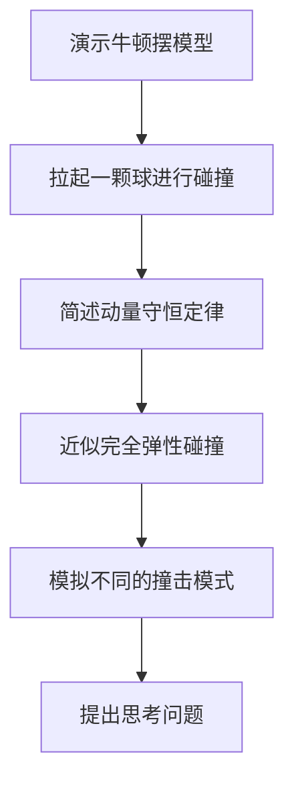
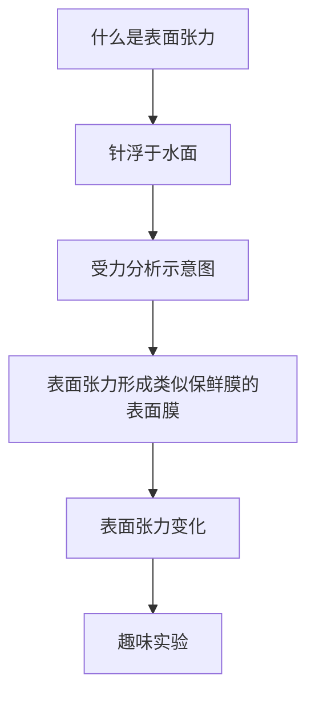
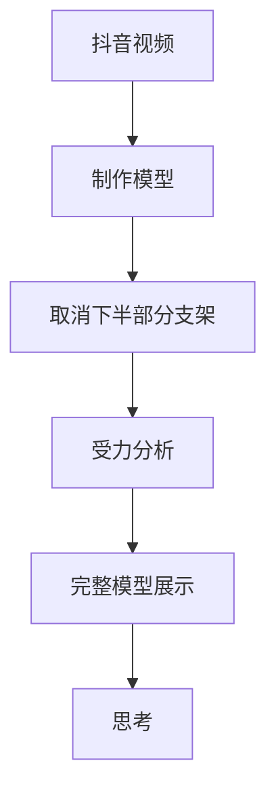
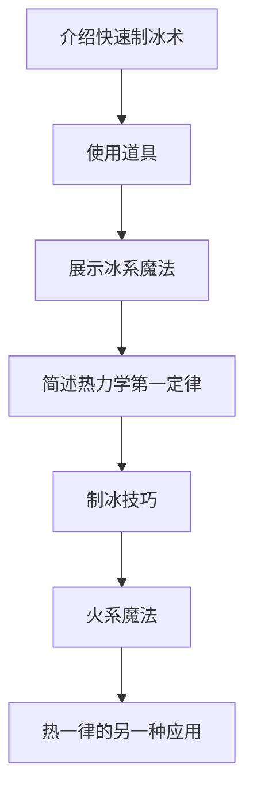
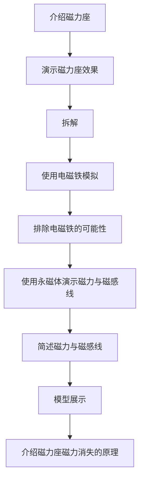

---
title: Stem视频  2018  物理类
tags: MARKDOWN,小书匠
grammar_abbr: true
grammar_table: true
grammar_defList: true
grammar_emoji: true
grammar_footnote: true
grammar_ins: true
grammar_mark: true
grammar_sub: true
grammar_sup: true
grammar_checkbox: true
grammar_mathjax: true
grammar_flow: true
grammar_sequence: true
grammar_plot: true
grammar_code: true
grammar_highlight: true
grammar_html: true
grammar_linkify: true
grammar_typographer: true
grammar_video: true
grammar_audio: true
grammar_attachment: true
grammar_mermaid: true
grammar_classy: true
grammar_cjkEmphasis: true
grammar_cjkRuby: true
grammar_center: true
grammar_align: true
grammar_tableExtra: true
--- 
## 牛顿摆 原理

#### 内容tips
1. 2球牛顿摆
2. 2球不同高度互相撞击
3. 3球，外侧两球撞击中间
4. 多球，拉起一侧不同数量球撞击另一侧
5. 多球，拉起两侧不同数量球撞击中间

```
动量守恒： 碰撞时，球与球之间发生速度的互换
公式   ： Δp1=－Δp2   m1v1+m2v2+…=m1v1ˊ+m2v2ˊ+…
思考   ： 牛顿摆一次摆动所产生的撞击次数？
```

#### 剪辑tips
1. 撞击过程慢放
2. 演示不同撞击时，提出思考后标注撞击次数


  
## 水的表面张力

#### 内容tips
1. 针浮于水面（违反 浮力--密度 关系）PS:直接放置大概率会沉下去，使用单层纸巾以利用表面张力
2. 分析水分子受力，表面张力形成的原因
3. 杂质降低杂质溶解部分的表面张力
4. 使用牛奶做演示 表现效果更好
5. 实验参考：黑胡椒，彩色墨水
6. 趣味实验：纸船尾端涂抹牙膏之类的


#### 剪辑tips
1. 插入受力分析图
2. 趣味实验中的受力分析
  
  
  
## 抖音悬浮支架

#### 内容tips
1. 静力与静力矩
2. 逐步增加绳子，达到受力平衡
3. 思考：受力平衡时，最少需要几根绳子

#### 剪辑tips
1. 先放抖音视频
2. 注意使用与背景不同色的绳子


## 冰系魔法师

#### 内容tips
1. 绝热膨胀
2. 冰系施法素材：自行车CO2快速打气瓶
3. 火系施法素材：气体压缩装置与可燃物
4. 注意安全

```
热力学第一定律： 物体内能的增加等于物体吸收的热量和对物体所作的功的总和。即热量可以从一个物体传递到另一个物体，也可以与机械能或其他能量互相转换，但是在转换过程中，能量的总值保持不变。其推广和本质就是著名的能量守恒定律。
公式       ： △U = △Q + △W
```

#### 剪辑tips
1. 火系魔法慢放


## 万磁王

#### 内容tips
1. 磁力方向是磁感线更密集的方向
2. 磁力线范围就是磁力范围
3. 磁感线无法被截断
4. 磁感线会受到铁等材料的影响，不会泄露的材料外部（材料横跨NS两级）

#### 剪辑tips
1. 
